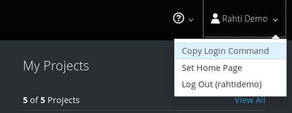

# Authorizing client session and creating a project

1. Log in to Rahti (at https://rahti.csc.fi:8443). Authorize command line
   session by clicking top right username → Copy Login Command:

   

   And pasting the text to command line:

   ```bash
   $ oc login https://rahti.csc.fi:8443 --token=<token>

   Logged into "https://rahti.csc.fi:8443" as "rahtidemo" using the token provided.
   ...
   ```

2. Create a project:

   ```bash
   oc new-project course-training-<number>
   ```

3. The project should be now visible on the web console and it should get
   listed with `oc projects` command.

   ```bash
   $ oc projects
   You have one project on this server: "course-rahti-<number>".

   Using project "course-rahti-<number>" on server "https://rahti.csc.fi:8443".
   ```
